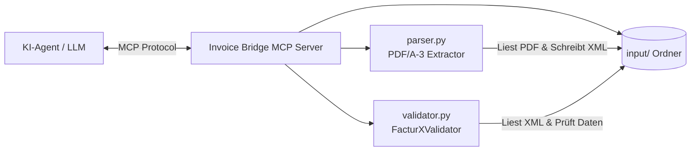

# 🌉 Invoice Bridge MCP

[](https://www.python.org/)
[](https://modelcontextprotocol.io/)
[](https://www.ferd-net.de/)
[](tests/)
[](LICENSE)

Ein robuster, produktionsreifer **Model Context Protocol (MCP) Server** zur automatisierten Extraktion, Analyse und Konformitätsprüfung von hybriden elektronischen Rechnungen (**ZUGFeRD** / **Factur-X**) und **§ 14 UStG** Pflichtangaben für KI-Assistenten (z. B. Claude Desktop, Antigravity, Cursor, Cline).

---

## 📋 Inhaltsverzeichnis

- [Überblick](#-überblick)
- [Funktionsumfang](#-funktionsumfang)
- [Architektur](#-architektur)
- [Installation & Schnellstart](#-installation--schnellstart)
- [MCP Konfiguration](#-mcp-konfiguration)
  - [Claude Desktop / Cline / Antigravity](#claude-desktop--cline--antigravity)
  - [Umgebungsvariablen](#umgebungsvariablen)
- [MCP Schnittstellen (Tools & Resources)](#-mcp-schnittstellen-tools--resources)
  - [Resources](#resources)
  - [Tools](#tools)
- [Validierte Regeln & Standards](#-validierte-regeln--standards)
- [Projektstruktur](#-projektstruktur)
- [Entwicklung & Tests](#-entwicklung--tests)
- [Roadmap & Geplante Features](#-roadmap--geplante-features)
- [Lizenz](#-lizenz)

---

## 💡 Überblick

Ab dem 01.01.2025 gilt in Deutschland die gesetzliche Verpflichtung zum Empfang elektronischer Rechnungen (E-Rechnung) im B2B-Bereich. **Invoice Bridge MCP** schließt die Lücke zwischen Dokumenten-Eingangsverzeichnissen, hybriden PDF/A-3-Rechnungsdateien und LLM-basierten Agenten.

Der MCP-Server ermöglicht KI-Assistenten:
1. Rechnungsdokumente im Eingangsordner aufzufinden (`invoices://list`).
2. Eingebettete XML-Rechnungsdaten aus PDF/A-3-Dateien verlustfrei zu extrahieren (`parse_invoice`).
3. XML-Rechnungen auf steuerrechtliche (§ 14 UStG) und EN 16931 Konformität zu prüfen (`validate_compliance`).
4. **PDF-Rechnungen in einem Schritt direkt zu prüfen** (`validate_invoice_pdf`).

---

## ✨ Funktionsumfang

- 📄 **PDF/A-3 Extraktion**: Erkennt und extrahiert eingebettete Factur-X / ZUGFeRD-Anhänge (`factur-x.xml`, `zugferd-invoice.xml`, `xrechnung.xml`).
- ⚡ **1-Step PDF Validierung**: Direkte Prüfung von PDF-Rechnungen ohne Zwischendatei.
- 🛡️ **Sicherheit & Resilienz**: Integrierte Path-Traversal-Absicherung (`..` Erkennung) und sicheres Fehlerhandling bei defektem XML.
- ⚖️ **§ 14 UStG & Schematron-Validierung**:
  - Rechnungsnummer, Ausstellungsdatum (Format 102 / YYYYMMDD), Rechnungstyp-Codes.
  - Vollständigkeit von Rechnungssteller und Leistungsempfänger.
  - Prüfung der Steuernummer und USt-IdNr. (Format & ISO-Ländercode-Prefix).
  - Währungscodes (ISO 4217) & Ländercodes (ISO 3166-1).
- 🧮 **Mathematische Konsistenzprüfung**:
  - Exakte Cent-genaue Prüfung mit `Decimal`: `Netto + USt == Brutto`.
  - Prüfung der maximalen Nachkommastellen (BR-DEC-Regeln).
- 🔌 **Standardkonformes MCP**: Basiert auf `FastMCP` mit automatischer Tool- und Ressourcen-Registrierung.

---

## 🏗️ Architektur



---

## 🚀 Installation & Schnellstart

### Voraussetzungen
- Python >= 3.10
- Virtuelle Umgebung empfohlen

### 1. Repository klonen & Virtual Environment erstellen
```bash
git clone https://github.com/Winterholdt/invoice-bridge-mcp.git
cd invoice-bridge-mcp

# Virtual Environment anlegen
python -m venv .venv

# Aktivieren (Windows PowerShell)
.venv\Scripts\Activate.ps1

# Aktivieren (Linux/macOS)
source .venv/bin/activate
```

### 2. Paket installieren
```bash
pip install -e .
```

---

## ⚙️ MCP Konfiguration

### Claude Desktop / Cline / Antigravity

Trage den MCP Server in deine Konfigurationsdatei (z. B. `claude_desktop_config.json`) ein:

```json
{
  "mcpServers": {
    "invoice-bridge": {
      "command": "c:/your/path/invoice-bridge-mcp/.venv/Scripts/python.exe",
      "args": [
        "c:/your/path/invoice-bridge-mcp/src/invoice_bridge/server.py"
      ],
      "env": {
        "INVOICE_INPUT_DIR": "c:/your/path/invoice-bridge-mcp/input"
      }
    }
  }
}
```

### Umgebungsvariablen

| Variable | Standardwert | Beschreibung |
|---|---|---|
| `INVOICE_INPUT_DIR` | `<Projekt-Root>/input` | Absoluter oder relativer Pfad zum Eingangsverzeichnis für Rechnungen. |

---

## 🛠️ MCP Schnittstellen (Tools & Resources)

### Resources

| URI | Beschreibung | Rückgabe |
|---|---|---|
| `invoices://list` | Listet alle im Eingangsordner (`input/`) vorhandenen `.pdf`- und `.xml`-Dateien auf. | Liste von Dateinamen (`["rechnung1.pdf", "rechnung2.xml"]`) |

---

### Tools

#### 1. `validate_invoice_pdf` (Empfohlen für PDFs)
Direkte Prüfung einer PDF-Rechnung in einem Schritt: Extrahiert eingebettete ZUGFeRD/Factur-X XML-Daten und validiert die Konformität nach § 14 UStG.

- **Eingabe-Parameter:**
  - `invoice_pdf_name` *(string, erforderlich)*: Dateiname der PDF im Ordner `input/` (z. B. `test.pdf`).
- **Rückgabe-Beispiel:**
  ```json
  {
    "status": "success",
    "invoice_id": "RE-2026-001",
    "compliance_checks": {
      "is_valid": true,
      "total_checks": 14,
      "passed": 14,
      "failed": 0,
      "failed_details": []
    },
    "approved_for_payment": true
  }
  ```

#### 2. `parse_invoice`
Extrahiert die eingebettete ZUGFeRD/Factur-X XML-Datei aus einer PDF-Rechnung und speichert sie als `.xml` im Eingangsordner.

- **Eingabe-Parameter:**
  - `invoice_pdf_name` *(string, erforderlich)*: Dateiname der PDF im Ordner `input/` (z. B. `test.pdf`).
- **Rückgabe-Beispiel:**
  ```json
  {
    "status": "success",
    "xml_file": "test.xml"
  }
  ```

#### 3. `validate_compliance`
Prüft eine vorhandene ZUGFeRD/Factur-X XML-Datei auf formale, strukturelle und rechnerische Konformität nach § 14 UStG und EN 16931 / Factur-X Profilen.

- **Eingabe-Parameter:**
  - `invoice_xml_name` *(string, erforderlich)*: Dateiname der XML im Ordner `input/` (z. B. `test.xml`).
- **Rückgabe-Beispiel:**
  ```json
  {
    "status": "success",
    "invoice_id": "INV-2026-001",
    "compliance_checks": {
      "is_valid": true,
      "total_checks": 14,
      "passed": 14,
      "failed": 0,
      "failed_details": []
    },
    "approved_for_payment": true
  }
  ```

---

## 📜 Validierte Regeln & Standards

| Regel-ID | Standard / Norm | Beschreibung |
|---|---|---|
| **BR-01** | EN 16931 / Factur-X | Profil-Spezifikation (Specification Identifier / BT-24) |
| **BR-02** | § 14 Abs. 4 Nr. 4 UStG | Fortlaufende Rechnungsnummer (BT-1) |
| **BR-03** | § 14 Abs. 4 Nr. 3 UStG | Ausstellungsdatum im Format 102 (`YYYYMMDD`) (BT-2) |
| **BR-04** | UN/CEFACT 1001 | Gültiger Rechnungstyp-Code (z. B. `380` Handelsrechnung, `381` Gutschrift) |
| **BR-05** | ISO 4217 | 3-stelliger Währungscode (BT-5, z. B. `EUR`) |
| **BR-06** | § 14 Abs. 4 Nr. 1 UStG | Name des Rechnungsstellers (Seller Name / BT-27) |
| **BR-07** | § 14 Abs. 4 Nr. 1 UStG | Name des Rechnungsempfängers (Buyer Name / BT-44) |
| **BR-09** | ISO 3166-1 | Ländercode des Rechnungsstellers (BT-40) |
| **BR-CO-26** | EN 16931 | Rechnungssteller-Identifikation (Seller ID, Legal Org ID, Tax ID) |
| **BR-CO-09** | § 14 Abs. 4 Nr. 2 UStG | USt-IdNr. mit korrektem Länder-Präfix oder Steuernummer |
| **BR-13..15** | EN 16931 | Pflichtsummen: Netto (`BT-109`), Brutto (`BT-112`), Zahlbetrag (`BT-115`) |
| **BR-DEC-\*** | EN 16931 | Maximal 2 Nachkommastellen bei Währungsbeträgen |
| **CALC-01** | § 14 Abs. 4 Nr. 7/8 UStG | Mathematische Konsistenz: `Netto + USt == Brutto` |

---

## 📁 Projektstruktur

```
invoice-bridge-mcp/
├── .github/
│   └── workflows/
│       └── ci.yml                # GitHub Actions CI Workflow (Python 3.10 - 3.12)
├── config/
│   └── mcp_config.example.json   # Vorlage für MCP-Client-Konfiguration
├── input/                        # Verzeichnis für Eingangsrechnungen (PDF/XML)
│   └── test.pdf
├── src/
│   └── invoice_bridge/           # Hauptpaket (Single Source of Truth)
│       ├── __init__.py
│       ├── parser.py             # PDF/A-3 Extractor mit robuster Fehlerbehandlung
│       ├── server.py             # FastMCP Server mit Path-Traversal-Schutz
│       └── validator.py          # FacturX / ZUGFeRD / § 14 UStG Prüflogik
├── test_invoices/                # Testrechnungen
│   ├── fail-xml-invalid.pdf
│   └── test.pdf
├── tests/                        # Vollständige Pytest-Suite
│   ├── test_parser.py
│   ├── test_server.py
│   └── test_validator.py
├── .gitignore
├── pyproject.toml                # Projekt-Metadaten, Entrypoints & Linter-Settings
└── README.md
```

---

## 🧪 Entwicklung & Tests

```bash
# Entwicklungsumgebung inkl. Test-Tools installieren
pip install -e .[dev]

# Linter ausführen
ruff check .

# Test-Suite ausführen
pytest -v
```

---

## 📄 Lizenz

Dieses Projekt ist unter der MIT-Lizenz lizenziert. Weitere Details in der [LICENSE](LICENSE)-Datei.